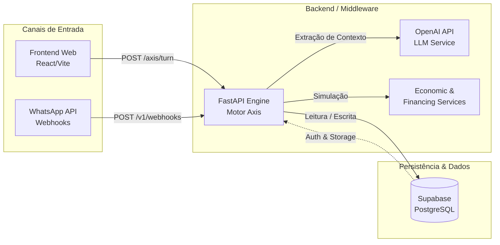
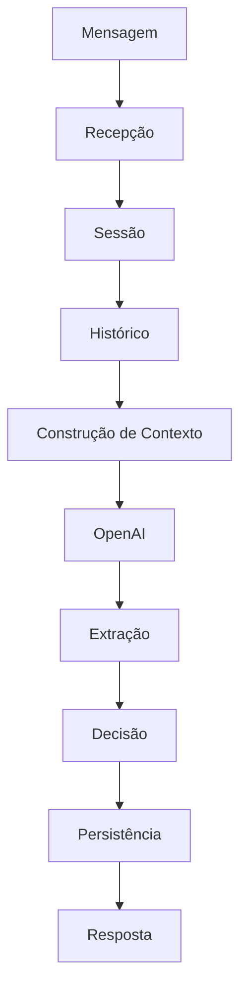

# Axis (Design Beacon) - Documentação Técnica Enterprise

> [!NOTE]
> Esta documentação destina-se a engenheiros de software, arquitetos de soluções e stakeholders técnicos que precisam compreender o funcionamento, a arquitetura e as decisões de design da plataforma Axis.

---

## 1. Introdução Executiva

O **Axis** (internamente também referenciado como **Design Beacon**) é uma plataforma inovadora voltada para o setor imobiliário que une uma experiência web fluida, rica e responsiva a um motor conversacional impulsionado por Inteligência Artificial (Middleware API). 

Ele não atua apenas como um site tradicional de listagem de imóveis, mas como um ecossistema inteligente capaz de qualificar leads, diagnosticar intenções, fornecer atendimento de nível 1 em múltiplos canais (Site e WhatsApp) e realizar transbordos (handoff) precisos para operadores humanos. Ao internalizar o fluxo conversacional com Python e FastAPI, o Axis substitui soluções de roteamento estáticas e visuais (como n8n ou Twilio Studio), conferindo escalabilidade, personalização avançada com OpenAI e integração direta ao ecossistema do cliente através do Supabase.

---

## 2. Filosofia do Projeto

A existência do Axis é fundamentada na necessidade de unificar a **Captação** (Frontend imobiliário) e a **Qualificação** (Motor de IA) em um ecossistema nativo e coeso.

O projeto nasce sob o princípio de que o contato inicial de um cliente (seja para compra, locação ou suporte financeiro) não deve ser engessado por menus de opções inflexíveis. A filosofia do Axis adota o uso de Modelos de Linguagem (LLMs) ancorados em **Máquinas de Estado Finito (FSM)** para oferecer um atendimento fluido, contextual e natural, onde a IA compreende as nuances da linguagem do cliente e avança de forma autônoma até o ponto em que a intervenção humana é estrategicamente indispensável.

---

## 3. Objetivos

### Objetivo Geral
Fornecer um hub tecnológico de ponta a ponta (Web + IA + Dados) para imobiliárias e corretores, que capture a intenção do cliente nos primeiros segundos de interação e ofereça respostas contextualizadas ou direcione adequadamente a demanda para a equipe humana.

### Objetivos Técnicos
- Centralizar regras de negócio em um Middleware FastAPI, evitando regras redundantes no frontend ou em webhooks externos.
- Assegurar resiliência e alta performance através de comunicação assíncrona, Rate Limiting nativo e persistência otimizada no Supabase.
- Garantir a unificação de sessões conversacionais, permitindo que a inteligência gerada seja acessível por qualquer canal conectado (Site, WhatsApp).

### Objetivos de Negócio
- Aumentar a taxa de conversão de leads, qualificando a intenção de compra ou locação 24 horas por dia.
- Reduzir o tempo de triagem do time humano ao encaminhar tickets (handoff) já com o contexto mapeado, incluindo perfil financeiro e imóvel de interesse.
- Diminuir a sobrecarga do setor administrativo e financeiro, automatizando o direcionamento de demandas de rotina.

---

## 4. Arquitetura Geral

O ecossistema Axis é dividido em camadas distintas que operam de forma orquestrada para garantir escalabilidade e separação de preocupações (Separation of Concerns). Todo o "peso" decisório da conversação reside na camada FastAPI. O Frontend e o WhatsApp atuam como interfaces de exibição que repassam a intenção do usuário e exibem as respostas geradas pela engine.



> [!IMPORTANT]
> A arquitetura mantém o estado da conversa exclusivamente no Supabase. A API FastAPI atua de forma `stateless`, processando turnos de conversa sob demanda.

---

## 5. Estrutura do Projeto

Abaixo, a representação hierárquica dos principais diretórios e módulos do repositório:

```text
design-beacon-main/
├── api/                             # Middleware / Backend (FastAPI)
│   ├── economic_service.py          # Serviços financeiros e econômicos
│   ├── finance_integration.py       # Integrações de simuladores
│   ├── financing_service.py         # Motor de simulação de crédito
│   ├── main.py                      # Ponto de entrada (App FastAPI e Endpoints)
│   ├── openai_service.py            # Integração com os LLMs da OpenAI
│   ├── security.py                  # Rate Limit, Sanitização e CORS
│   ├── supabase_service.py          # ORM Data Access Layer (Banco de Dados)
│   └── whatsapp_service.py          # Processamento de Webhooks do WhatsApp
│
├── database/                        # Schema Management e SQL Scripts
│   ├── schema.sql                   # Tabela base (sessions, messages, handoff_tickets)
│   ├── properties_extension.sql     # Estrutura do catálogo de imóveis
│   └── schema_whatsapp_v1.sql       # Extensão para gestão de leads de WhatsApp
│
├── src/                             # Frontend Web (React + Vite)
│   ├── assets/                      # Imagens, Ícones e SVG
│   ├── components/                  # UI Components (Shadcn, Radix UI)
│   ├── config/                      # Configurações de ambiente front
│   ├── hooks/                       # Custom React Hooks (useToast, etc)
│   ├── lib/                         # Utilitários (Formatadores, Tailwind Merge)
│   ├── pages/                       # Views principais (Index, Properties, Simulator, ClientArea)
│   ├── App.tsx                      # Componente Raiz
│   └── main.tsx                     # Ponto de montagem no DOM
│
├── docs/                            # Documentações adicionais
├── n8n/                             # Fluxos gráficos (legado/fallback)
├── playwright-fixture.ts            # Testes E2E (Playwright)
├── package.json                     # Dependências do ecossistema Node (React)
└── tailwind.config.ts               # Tokens de design do TailwindCSS
```

---

## 6. Fluxo Completo

O processamento de mensagens no Axis segue uma esteira determinística para cada requisição recebida:



1. **Recepção**: O usuário envia uma mensagem pela Web (`/axis/turn`) ou via WhatsApp.
2. **Sessão**: O Backend checa se o `session_id` existe e está ativo no banco. Se não, inicializa uma nova sessão.
3. **Histórico**: A `message` atual do usuário é persistida imediatamente.
4. **Construção de Contexto**: O sistema recupera histórico (`messages`), estado atual (`current_state`) e dados inferidos (`collected_data`).
5. **OpenAI**: O Backend envia os dados ao modelo (System Prompt + Contexto + Input).
6. **Extração**: A IA processa o turno e retorna uma classificação semântica e os novos dados inferidos.
7. **Decisão**: A FSM (Máquina de Estados) decide se avança para uma nova etapa, se transborda (Handoff) ou se apenas responde.
8. **Persistência**: Novos dados, status atualizados e a mensagem gerada pela IA são serializados no banco.
9. **Resposta**: O turno do assistente é devolvido para a interface Web ou WhatsApp.

---

## 7. Fluxo Conversacional

A orquestração do diálogo embasa-se no contexto conversacional armazenado. Elementos-chave incluem:

| Componente | Descrição |
| :--- | :--- |
| **Session** | A âncora principal. Vincula o usuário ao histórico temporário e dita em qual etapa de maturidade a conversa se encontra. |
| **Current State** | Controla o estágio atual do workflow (ex: recepção, qualificação). Define o "tom" e o objetivo principal das perguntas do bot. |
| **Collected Data** | Dicionário `JSONB` que funciona como a memória da IA. Preenche-se conforme o cliente fornece detalhes. |
| **Intent** | A intenção detectada por debaixo dos panos (Comercial, Administrativo, Financeiro, etc). |
| **History** | Trilha dos últimos turnos (User e Assistant), fundamental para prover continuidade sem repetições. |
| **Handoff** | A transição para o humano. Ocorre quando a IA conclui o fluxo ou identifica urgência/frustração, transferindo a `session` para tickets. |

---

## 8. Máquina de Estados (State Machine)

A arquitetura orientada a estados garante que o assistente sempre tenha um direcionamento claro. O `current_state` (enumerador no banco) pode assumir os seguintes valores:

- **recepcao**: Etapa de boas-vindas. Foco na identificação inicial do usuário e intenção principal.
- **diagnostico**: Mergulho no problema/intenção. Se é locação, a IA tenta descobrir orçamento ou bairro desejado.
- **qualificacao**: Validação do perfil do usuário (condição financeira, urgência, ou documentação).
- **conducao**: Envio ativo de sugestões de imóveis, detalhamento de dados pesquisados e orientações específicas.
- **encaminhamento**: O momento do transbordo. A sessão com a IA é finalizada ou paralisada para que um humano assuma (Ticket Criado).
- **acompanhamento**: Estado de follow-up, focado em feedback e nutrição após a interação principal ter ocorrido.

---

## 9. Banco de Dados

Toda a operação se apoia em tabelas relacionais do PostgreSQL (via Supabase), estruturadas para escalabilidade e indexação em JSONB.

### 9.1 Tabelas de Motor Conversacional

| Tabela | Descrição Principal |
| :--- | :--- |
| `sessions` | Controla a Máquina de Estados. Armazena `current_state`, `collected_data` (JSONB), e o controle `is_active`. |
| `messages` | Trilha de auditoria das conversas. Armazena a transcrição bruta (`role`, `content`) e metadados gerados pela NLU. |
| `handoff_tickets` | Fila de trabalho para corretores ou atendentes. Armazena o `setor_destino`, `prioridade` e o JSON do contexto mapeado pelo bot. |

### 9.2 Tabelas de WhatsApp (Integração)

| Tabela | Descrição Principal |
| :--- | :--- |
| `whatsapp_contacts` | Persiste dados únicos de contatos do WhatsApp (telefone normalizado). Mantém o rastreio do último contato e status comercial. |
| `whatsapp_messages` | Histórico bruto dos Webhooks. Separa mensagens de WhatsApp da engine principal para isolamento e debugging. |

### 9.3 Catálogo Imobiliário

| Tabela | Descrição Principal |
| :--- | :--- |
| `properties` | Catálogo nativo e estruturado do portfólio de imóveis. Mantém código, preço, dimensões, status de disponibilidade e URL de imagens. |

---

## 10. API

Os serviços do Middleware são expostos em rotas FastAPI bem definidas.

### 10.1 POST `/axis/turn`
Ponto focal da interface Web para o envio de mensagens.

- **Request**:
  ```json
  {
    "channel": "website",
    "browser_user_id": "usr_123456",
    "message": "Quero ver apartamentos no centro",
    "session_id": "uuid-opcional",
    "property_code": "REF001"
  }
  ```
- **Response**:
  ```json
  {
    "status": "ok",
    "session_id": "novo-ou-existente-uuid",
    "reply": "Entendi! Você procura apartamentos para locação ou compra?",
    "current_state": "diagnostico",
    "handoff_triggered": false
  }
  ```
- **Descrição**: Rota que orquestra todo o fluxo, da recepção da mensagem, processamento LLM, persistência e devolução do novo estado.

### 10.2 POST `/client-area/contracts/search`
Endpoint para pesquisa e recuperação de informações em área logada do cliente.

- **Request**: Envio obrigatório de `document` (CPF ou CNPJ).
- **Response**: Retorna Array de contratos (`id`, `contract_number`, `pdf_url`) e timestamps.
- **Descrição**: Rota de busca estrita. Nunca retorna metadados críticos como `pdf_path` interno. Contém rate limiting severo para evitar enumeração.

### 10.3 GET `/health`
- **Descrição**: Health check básico do backend. Retorna versão e status (`up`).

---

## 11. Segurança

O sistema aborda a segurança e mitigação de vulnerabilidades nas camadas de roteamento interno:

- **Rate Limit**: O sistema bloqueia consultas massivas via `check_rate_limit`. Consultas iterativas sem intervalos razoáveis recebem HTTP 429 para evitar gastos abusivos de API e scrapers de CPF.
- **Sanitização**: Todas as strings de ID passam pela função `sanitize_id`. Filtros rigorosos previnem injeção SQL no tráfego direcionado ao Supabase.
- **CORS**: As origens (Cross-Origin Resource Sharing) são delimitadas na variável `CORS_ORIGIN`, garantindo que apenas os domínios homologados se conectem à API.
- **LGPD**: A política "Data Privacy by Design" garante que informações como `pdf_path` ou variáveis internas nunca retornem em payloads de Frontend (ex: Área do Cliente).
- **Webhooks**: Validação rigorosa dos eventos para os webhooks abertos ao WhatsApp.
- **Logs**: Todas as violações de Rate Limit ou queries anômalas resultam em registros detalhados no stderr.

> [!WARNING]
> O Frontend nunca deve possuir chaves do Supabase em formato `service_role`. Todo acesso aos bancos é intermediado pelo FastAPI.

---

## 12. Observabilidade

O projeto Axis monitora ativamente sua integridade através de:

- **Logs Estruturados**: As tratativas de erros não repassam "Tracebacks" brutos ao usuário, mas sim logs higienizados para o Console do Render/Uvicorn.
- **Tracing**: O fluxo temporal de timestamps nas tabelas de eventos (`sessions`, `messages`, `whatsapp_messages`, `handoff_tickets`) cria um modelo auditável e rastreável.
- **Health Checks**: Rota exposta dedicada para serviços de Uptime (como UptimeRobot ou Cloudflare Load Balancers) acessarem periodicamente a vida útil do Pod FastAPI.
- **Métricas Orgânicas**: As queries nos bancos já fornecem indicadores diretos da performance de retenção da IA vs proporção de tickets repassados ao humano.

---

## 13. Deploy

A estratégia de infraestrutura reparte a responsabilidade tecnológica entre fornecedores otimizados:

- **Frontend (React/Vite)**: Hospedado em provedores de Web Hosting de alta performance focados na distribuição por Edge Servers (ex: Netlify).
- **Backend (FastAPI)**: Distribuído como Web Service pela Cloud do Render (utilizando Gunicorn + Uvicorn via especificação `render.yaml`).
- **Supabase (PostgreSQL)**: Responsável não só pelo relacional como também pelo provimento nativo de Storage para eventuais mídias.
- **Variáveis de Ambiente Críticas**:
  - `VITE_AXIS_WEBHOOK_URL` (Frontend)
  - `OPENAI_API_KEY`, `SUPABASE_URL`, `SUPABASE_KEY`, `CORS_ORIGIN` (Backend)

---

## 14. Escalabilidade

As decisões arquiteturais foram pensadas para permitir que a plataforma não trave quando o tráfego escalar:

- **Escalonamento Horizontal (Horizontal Scaling)**: Por ser *stateless* e salvar tudo no banco de dados, o backend FastAPI permite que múltiplas instâncias sejam levantadas simultaneamente sem perda de sincronismo das conversas.
- **Desacoplamento Assíncrono**: O FastAPI roda nativamente com `async def`, lidando maravilhosamente com centenas de I/O bounds de chamadas para a OpenAI.
- **Tolerância a Picos**: Rate Limiters contêm o esgotamento precoce de crédito (budget control) de LLMs se sofrer um ataque malicioso.

---

## 15. Melhorias Futuras (Roadmap)

Os itens a seguir não existem na versão atual, mas são arquiteturalmente previstos para implementações orgânicas no futuro:

- **Redis Cache Layer**: Poderá ser implementado um cluster de cache Redis para armazenar temporariamente as `sessions` ativas, cortando o custo de `SELECTs` em alta densidade no banco PostgreSQL principal.
- **Background Workers e Queues**: Numa evolução futura, eventos densos — como o download de fotos de imóveis de outros CRMs, processamento de áudio em massa do WhatsApp (Whisper) ou extração demorada de intenções — poderão ser transferidos para filas robustas (ex: Celery / RabbitMQ / SQS), sem engarrafar a API web.
- **Distributed Tracing**: Está previsto o uso de ferramentas nativas como OpenTelemetry, para mapear a latência real de um clique no botão do site até o retorno final da OpenAI via Grafana/Prometheus.
- **Webhooks Seguros de Nível Financeiro**: Pode ser expandido e reforçado a camada de verificação de Webhooks, checando `X-Hub-Signature` ou chaves criptográficas assimétricas em todos os endpoints, o que é fundamental numa expansão de escopo transacional de aluguéis.
- **Agentic Workflows**: Numa evolução futura, a OpenAI API local poderá ser substituída ou auxiliada por LLMs orquestrando "Tools" de forma reativa, sem a necessidade da Máquina de Estados tradicional, operando como verdadeiros Agentes Imobiliários.
